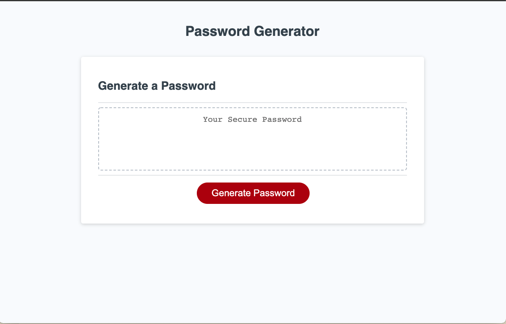

# Password Generator

## Description

This application will allow a user to generate a password from randomly selected characters.
The user will be prompted to choose which type of characters they'd like to include in their password.
This application will allow a user to produce a strong password that will match their criteria.
As a developer, my JavaScript prowess was exercised with the use of if statements, and for loops.

## Installation

No installation required! simply visit https://thisisjona.github.io/password-generator/  

## Usage

Upon visiting the site, press the "Create Password" button.
You will be prompted on whether you'd like to include certain character types.
Your new password will be generated! Copy, and paste your password where inteded!

## Credits
The majority of the code was written by me, Jonathan Rivera. 
My tutor, Faizan Alsam, was a great guide to help me tweak the code where necessary.

---

